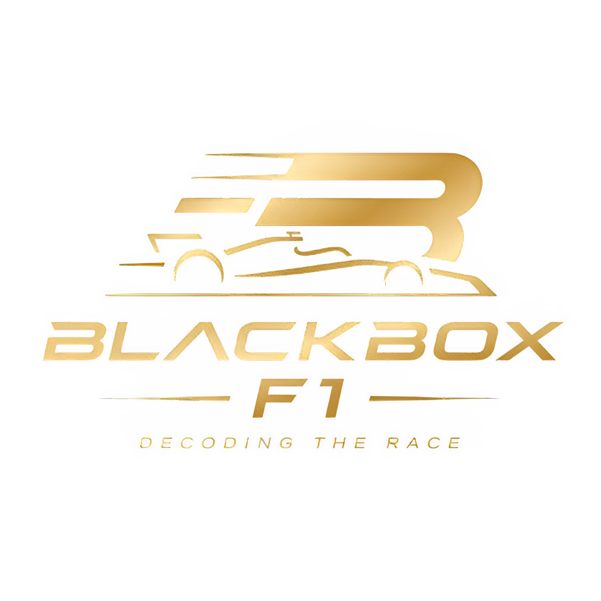

  <picture>
    <!-- Usamos tu logo principal de BlackBox-F1 para la cabecera -->
    <source media="(prefers-color-scheme: dark)" srcset="./dashboard/public/logoprincipal.png" width="280">
    
  </picture>

<h1 align="center">BlackBox-F1</h1>

  <strong>Telemetría y tiempos de Formula 1 en vivo, con una interfaz moderna y optimizada en español.</strong>

---

## 🏎️ Acerca del Proyecto

**BlackBox-F1** es una evolución estética y de rendimiento basada en la arquitectura Open Source de `f1-dash`. Este proyecto nace con el objetivo de ofrecer una plataforma completamente traducida al español, con un diseño pulido de alto impacto visual y un backend reestructurado para garantizar estabilidad absoluta durante las sesiones del campeonato.

### Características principales:
* 📊 **Tabla de posiciones y tiempos en tiempo real**: Datos precisos de vueltas, compuestos de neumáticos y deltas.
* ⚡ **Algoritmo de localización por minisectores**: Estimación inteligente de la posición aproximada de los monoplazas en pista para sortear las restricciones de los servicios oficiales.
* 🦀 **Backend robusto en Rust**: Procesamiento de datos ultra rápido montado sobre contenedores Docker.
* 🎨 **Interfaz inmersiva**: Diseño adaptado con estética de fibra de carbono, transparencias de tipo vidrio esmerilado y optimización para monitores de alta resolución.

---

## 🛠️ Desarrollo Local

Este proyecto utiliza una infraestructura dividida en microservicios gestionada por **Docker**. Para levantar la plataforma en tu entorno local para desarrollo, parate en la raíz del repositorio y ejecutá:
